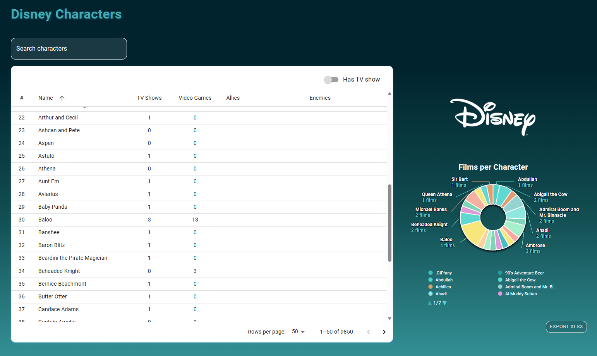

# Disney Characters Dashboard

A modern React dashboard for exploring Disney characters using the [Disney API](https://disneyapi.dev/).


<!-- Add your screenshot here -->

## Features

- **Data Table**: Browse Disney characters with pagination, search, sorting, and TV show filtering
- **Pie Chart**: Interactive donut chart showing films per character with export to XLSX
- **Character Modal**: Detailed view with character image, TV shows, and video games
- **Responsive Design**: Works seamlessly on desktop and mobile devices
- **Disney-themed UI**: Custom styling with magical gradient backgrounds

## Getting Started

### Installation

```bash
npm install
```

### Running the Application

```bash
npm start
# or
npm run dev
```

The application will be available at `http://localhost:8000`

### Build for Production

```bash
npm run build
```

## Tech Stack

- React 18
- Redux Toolkit (state management)
- Material-UI (components)
- Highcharts (data visualization)
- Vite (build tool)

## Project Structure

```
src/
├── components/    # UI components
├── features/      # Redux slices and selectors
├── pages/         # Page components
├── services/      # API service layer
└── styles.css     # Global styles
```

## Key Features

- Real-time search with debounce (300ms)
- Pagination: 10, 20, 50, 100, 200, 500 items per page
- Filter by TV show participation
- Sort by character name
- Export chart data to XLSX
- Responsive modal with character details

---

Made using React and Redux Toolkit
